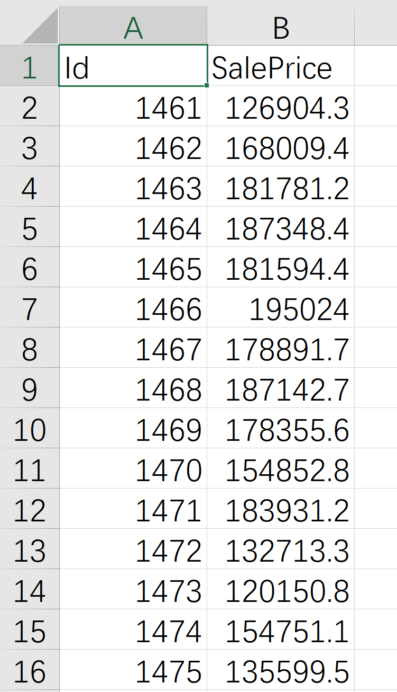

# 实验报告：线性回归作业

## 1. 任务描述：

### 1. 项目描述：

​		本次实验的数据集来自于`kaggle`上的竞赛项目`House Prices - Advanced Regression Techniques`，竞赛描述如下：

### Competition Description


Ask a home buyer to describe their dream house, and they probably won't begin with the height of the basement ceiling or the proximity to an east-west railroad. But this playground competition's dataset proves that much more influences price negotiations than the number of bedrooms or a white-picket fence.

With 79 explanatory variables describing (almost) every aspect of residential homes in Ames, Iowa, this competition challenges you to predict the final price of each home.

### 2. 项目目标：

​		使用`kaggle`中所提供的数据集训练线性模型，实现对于房价的预测。


## 2. 实验流程：

### 1. 数据处理：

#### 1. 数据读取：

​		首先，对训练集的csv文件进行读取，查看其特征数据的大概情况。

```python
raw_data = pd.read_csv(filename)
print(raw_data.describe())
print(raw_data.head(10))

# 控制台显示
			   Id   MSSubClass  ...       YrSold      SalePrice
count  1460.000000  1460.000000  ...  1460.000000    1460.000000
mean    730.500000    56.897260  ...  2007.815753  180921.195890
std     421.610009    42.300571  ...     1.328095   79442.502883
min       1.000000    20.000000  ...  2006.000000   34900.000000
25%     365.750000    20.000000  ...  2007.000000  129975.000000
50%     730.500000    50.000000  ...  2008.000000  163000.000000
75%    1095.250000    70.000000  ...  2009.000000  214000.000000
max    1460.000000   190.000000  ...  2010.000000  755000.000000

[8 rows x 38 columns]
   Id  MSSubClass MSZoning  ...  SaleType  SaleCondition SalePrice
0   1          60       RL  ...        WD         Normal    208500
1   2          20       RL  ...        WD         Normal    181500
2   3          60       RL  ...        WD         Normal    223500
3   4          70       RL  ...        WD        Abnorml    140000
4   5          60       RL  ...        WD         Normal    250000
5   6          50       RL  ...        WD         Normal    143000
6   7          20       RL  ...        WD         Normal    307000
7   8          60       RL  ...        WD         Normal    200000
8   9          50       RM  ...        WD        Abnorml    129900
9  10         190       RL  ...        WD         Normal    118000

[10 rows x 81 columns]
```

​		可以看到，我们共有81条属性。去掉预测值`SalePrice`与索引值`Id`后，我们有79个特征，其中有38个数字特征，其他为文字特征。

#### 2. Nan值处理： 

​		在特征中存在大量的Nan值，会影响我们预测效果，所以我们需要对Nan值进行处理。

​		首先我们需要将存在大量Nan值的特征进行删除，我们可以将Nan值超过 30% 的属性视为无效属性进行删除。

```python
train_nan = 100 * raw_data.isnull().mean()
train_nan[train_nan.values > 0].sort_values(ascending=False)
print(train_nan[train_nan.values > 0].sort_values(ascending=False))

# 控制台显示
PoolQC          99.520548
MiscFeature     96.301370
Alley           93.767123
Fence           80.753425
FireplaceQu     47.260274
LotFrontage     17.739726
GarageYrBlt      5.547945
GarageType       5.547945
GarageFinish     5.547945
GarageQual       5.547945
GarageCond       5.547945
BsmtFinType2     2.602740
BsmtExposure     2.602740
BsmtFinType1     2.534247
BsmtCond         2.534247
BsmtQual         2.534247
MasVnrArea       0.547945
MasVnrType       0.547945
Electrical       0.068493
```

​	我们可以发现，属性`PoolQC`、`MiscFeature`、`Alley`、`Fence`、`FireplaceQu`的Nan值含量均超过了30%，所以我们需要对其进行手动去除。

```python
drop = ['PoolQC', 'MiscFeature', 'Alley', 'Fence', 'FireplaceQu']
train_data.drop(drop, axis=1, inplace=True)
```

​	去除含有大量Nan值的属性后，我们需要对于其他属性中的Nan值进行填充与替换。

​	首先我们需要将属性分为数字属性与文字属性，对于数字属性，我们对于Nan值填充该属性的平均值；对于文字属性，我们对于Nan值填充指定字符`N/A`。

```python
# 获取数组和非数字字段
def get_numeric_and_non(raw_data):
    # 数字字段
    numeric_colmuns = []
    # int和float
    numeric_colmuns.extend(list(raw_data.select_dtypes(include=[np.int64, np.float64]).columns))
    # 文字字段
    non_numeric_columns = [col for col in list(raw_data.columns) if col not in numeric_colmuns]
    numeric_colmuns.remove('Id')

    numeric_data = DataFrame(raw_data, columns=numeric_colmuns)
    non_numeric_data = DataFrame(raw_data, columns=non_numeric_columns)

    return numeric_data, non_numeric_data

# 数字字段Nan处理
def deal_nan_num(data):
    nan_columns = np.any(pd.isna(data), axis=0)
    # 获取标签
    nan_columns = list(nan_columns[nan_columns == True].index)
    # 将nan变为0
    for i in nan_columns:
        data[i] = data[i].fillna(data[i].mean())
    return data

# 文字字段Nan处理
def deal_nan_non_num(data):
    nan_columns = np.any(pd.isna(data), axis=0)
    # 获取标签
    nan_columns = list(nan_columns[nan_columns == True].index)
    # 将nan变为0
    for i in nan_columns:
        data[i] = data[i].fillna('N/A')
    return data

```

#### 3. 字典映射：

​	因为文字属性中的文字不能供我们的线性模型进行预测，所以我们需要将文字映射为数字，以供我们的模型使用

```python
# 字典映射
def mapping(data):
    mapping_table = dict()
    for col in list(data.dtypes.index):
        curr_mapping_table = dict()
        unique_values = pd.unique(data[col])
        for inx, v in enumerate(unique_values):
            curr_mapping_table[v] = inx + 1
            data[col] = data[col].replace(v, inx + 1)
        mapping_table[col] = curr_mapping_table
    return mapping_table
```

#### 4. 归一化：

​	由于我们的属性中，数据大小差距过大，不方便我们进行训练。所以我们应当在保持数据分布信息不变的前提下，对数据进行缩放，使得各属性数据位于相似的区间内，这样我们在模型训练时会收获更加优异的表现。

```python
# 归一化
def norm(data):
    means, maxs, mins = dict(), dict(), dict()
    for col in data:
        means[col] = data[col].mean()
        maxs[col] = data[col].max()
        mins[col] = data[col].min()
    return (data - data.mean()) / (data.max() - data.min()), means, maxs, mins
```

​	注意在归一化过程中，我们需要将训练集的均值、最大值和最小值保存下来，在对测试集进行预测时需要`SalePrice`的均值、最大值和最小值进行数据复原。

---

### 2. 网络模型：

#### 1.  模型搭建：

​	在本次实验中，我们使用了`pytorch`框架辅助我们进行模型搭建，这样节省了我们的很大部分精力，让我们可以将工作重点放在数据处理与模型调优上。

​	首先我们需要对训练集分离特征和预测值，并将其转换为Tensor类型，以供模型进行读取。

```python
# 分离x，y
y = train_data[['SalePrice']]
x = train_data.drop(['SalePrice'], axis=1)
# 生成tensor向量
x = torch.tensor(x.values, dtype=torch.float)
y = torch.tensor(y.values, dtype=torch.float)
```

​	而后，我们需要搭建我们的模型。因为单层的线性回归模型无法很好地拟合该数据集，于是我们使用了多层线性模型构成的深度模型，即由多个全连接层构成的深度神经网络模型。

​	在每一个全连接层后，我们使用了`Relu`函数作为激活函数，并使用`Dropout`进行正则化。同时，我们使用了`xavier`对全连接层的参数进行初始化。

```python
def init_weights(m):
    if type(m) in [nn.Linear, nn.Conv2d]:
        nn.init.xavier_uniform_(m.weight)

net = nn.Sequential(nn.Linear(x.shape[1], 256), nn.ReLU(), nn.Dropout(0.5),
                    nn.Linear(256, 512), nn.ReLU(), nn.Dropout(0.5),
                    nn.Linear(512, 256), nn.ReLU(), nn.Dropout(0.5),
                    nn.Linear(256, 1))
net.apply(init_weights)
```

#### 2. 模型训练：

​	我们使用均方误差作为我们的损失函数，使用`Adam`作为我们的优化方法。相比于传统的梯度下降，`Adam`对于学习率的选择很不敏感，十分适合我们进行使用，让我们的调参过程更加方便。

```python
# 均方误差
loss = nn.MSELoss()  # Adam优化，不依赖与学习率的选择
optimizer = torch.optim.Adam(net.parameters(), lr=1e-4 * 5)
# 训练
model, losses = train(net, x, y, loss, optimizer, 1000)


def train(model, x, y, loss, optimizer, epoch):
    # gpu训练
    device = try_gpu()
    model.to(device)
    x = x.to(device)
    y = y.to(device)

    losses = []

    for t in range(epoch):
        y_pred = model(x)
        l = loss(y_pred, y)
        print(t, l.item())
        losses.append(l.item())
        if torch.isnan(l):
            break
        optimizer.zero_grad()
        l.backward()
        optimizer.step()
    return model, losses

# 画图
plt.figure(figsize=(12, 10))
plt.plot(range(len(losses)), losses)
plt.show()
```

​	我们选取的学习率为`1e-4 * 5`，训练`1000`轮，训练完成后输出损失图像。


​	可以看到我们的函数已经成功收敛了，最终损失为`0.0011904728598892689`。


## 3. 实验结果：

### 1. 预测函数：

```python
 def prediction(data, model, device):
    data = data.to(device)
    return model(data)

# 测试集预测
test_data = load('data/test.csv')
test_data.drop(features_to_drop, axis=1, inplace=True)
test_data, _, _, _ = norm(test_data)
test_tensor = torch.tensor(test_data.values, dtype=torch.float)
y_hat = prediction(test_tensor, model, try_gpu())
# 复原
y_hat = y_hat * (maxs['SalePrice'] - mins['SalePrice']) + means['SalePrice']
print(y_hat)

# 运行结果
tensor([[126904.2500],
        [168009.4375],
        [181781.2188],
        ...,
        [179118.1094],
        [135212.3594],
        [218428.5938]], device='cuda:0', grad_fn=<AddBackward0>)
```

​	我们使用训练好的模型对测试集进行预测，注意预测完成后需要进行预测值的复原。

### 2. 数据保存：

```python
# 添加id行
raw_data = pd.read_csv('data/test.csv')
result = raw_data[['Id']]
result['SalePrice'] = y_hat.cpu().detach().numpy()
print(result.head(10))
result.to_csv('result.csv', index=None)

# 运行结果
     Id      SalePrice
0  1461  126904.250000
1  1462  168009.437500
2  1463  181781.218750
3  1464  187348.406250
4  1465  181594.390625
5  1466  195024.015625
6  1467  178891.734375
7  1468  187142.671875
8  1469  178355.625000
9  1470  154852.765625
```

​	为了在`kaggle`上进行成绩提交，我们需要将预测结果保存为该竞赛所指定的形式，结果csv文件如下所示。



### 3. 成绩提交：

​	在`kaggle`上提交我们的结果文件，得到我们的成绩，并查看我们在竞赛中的排名。


## 4. 实验代码：

```python
import numpy as np
import pandas as pd
from pandas import DataFrame
import matplotlib.pyplot as plt
import torch
import torch.nn as nn


def try_gpu(i=0):
    if torch.cuda.device_count() >= i + 1:
        return torch.device(f'cuda:{i}')
    return torch.device('cpu')


def try_all_gpus():
    devices = [torch.device(f'cuda:{i}')
               for i in range(torch.cuda.device_count())]
    return devices if devices else [torch.device('cpu')]


# 获取数组和非数字字段
def get_numeric_and_non(raw_data):
    # 数字字段
    numeric_colmuns = []
    # int和float
    numeric_colmuns.extend(list(raw_data.select_dtypes(include=[np.int64, np.float64]).columns))
    # numeric_colmuns.remove('SalePrice')
    # numeric_colmuns.append('SalePrice')
    # 文字字段
    non_numeric_columns = [col for col in list(raw_data.columns) if col not in numeric_colmuns]
    numeric_colmuns.remove('Id')

    numeric_data = DataFrame(raw_data, columns=numeric_colmuns)
    non_numeric_data = DataFrame(raw_data, columns=non_numeric_columns)

    return numeric_data, non_numeric_data


def deal_nan_num(data):
    nan_columns = np.any(pd.isna(data), axis=0)
    # 获取标签
    nan_columns = list(nan_columns[nan_columns == True].index)
    # 将nan变为0
    for i in nan_columns:
        data[i] = data[i].fillna(data[i].mean())
    return data


def deal_nan_non_num(data):
    nan_columns = np.any(pd.isna(data), axis=0)
    # 获取标签
    nan_columns = list(nan_columns[nan_columns == True].index)
    # 将nan变为0
    for i in nan_columns:
        data[i] = data[i].fillna('N/A')
    return data


def mapping(data):
    mapping_table = dict()
    for col in list(data.dtypes.index):
        curr_mapping_table = dict()
        unique_values = pd.unique(data[col])
        for inx, v in enumerate(unique_values):
            curr_mapping_table[v] = inx + 1
            data[col] = data[col].replace(v, inx + 1)
        mapping_table[col] = curr_mapping_table
    return mapping_table


# 归一化
def norm(data):
    means, maxs, mins = dict(), dict(), dict()
    for col in data:
        means[col] = data[col].mean()
        maxs[col] = data[col].max()
        mins[col] = data[col].min()
    return (data - data.mean()) / (data.max() - data.min()), means, maxs, mins


def load(filename):
    raw_data = pd.read_csv(filename)
    # 显示缺失值百分比
    missing_train_df = 100 * raw_data.isnull().mean()
    missing_train_df[missing_train_df.values > 0].sort_values(ascending=False)
    print(missing_train_df[missing_train_df.values > 0].sort_values(ascending=False))

    # 获取文字与数字部分
    numeric_data, non_numeric_data = get_numeric_and_non(raw_data)
    # 去除nan
    numeric_data = deal_nan_num(numeric_data)
    non_numeric_data = deal_nan_non_num(non_numeric_data)
    # 文字部分做映射
    mapping_table = mapping(non_numeric_data)
    # 合并
    return pd.concat([non_numeric_data, numeric_data], axis=1)


def train(model, x, y, loss, optimizer, epoch):
    # gpu训练
    device = try_gpu()
    model.to(device)
    x = x.to(device)
    y = y.to(device)

    losses = []

    for t in range(epoch):
        y_pred = model(x)
        l = loss(y_pred, y)
        print(t, l.item())
        losses.append(l.item())
        if torch.isnan(l):
            break
        optimizer.zero_grad()
        l.backward()
        optimizer.step()
    return model, losses


def init_weights(m):
    if type(m) in [nn.Linear, nn.Conv2d]:
        nn.init.xavier_uniform_(m.weight)


def prediction(data, model, device):
    data = data.to(device)
    return model(data)


if __name__ == '__main__':
    train_data = load('data/train.csv')

    features_to_drop = ['PoolQC', 'MiscFeature', 'Alley', 'Fence', 'FireplaceQu']
    train_data.drop(features_to_drop, axis=1, inplace=True)

    # 标准化
    train_data, means, maxs, mins = norm(train_data)
    # 分离x，y
    y = train_data[['SalePrice']]
    x = train_data.drop(['SalePrice'], axis=1)
    # 生成tensor向量
    x = torch.tensor(x.values, dtype=torch.float)
    y = torch.tensor(y.values, dtype=torch.float)

    net = nn.Sequential(nn.Linear(x.shape[1], 256), nn.ReLU(), nn.Dropout(0.5),
                        nn.Linear(256, 512), nn.ReLU(), nn.Dropout(0.5),
                        nn.Linear(512, 256), nn.ReLU(), nn.Dropout(0.5),
                        nn.Linear(256, 1))
    # 模型构建
    net.apply(init_weights)
    # 均方误差
    loss = nn.MSELoss()  # Adam优化，不依赖与学习率的选择
    optimizer = torch.optim.Adam(net.parameters(), lr=1e-4 * 5)
    # 训练
    model, losses = train(net, x, y, loss, optimizer, 5000)

    # 画图   plt.figure(figsize=(12, 10))
    plt.plot(range(len(losses)), losses)
    plt.show()

    # 测试集预测
    test_data = load('data/test.csv')

    test_data.drop(features_to_drop, axis=1, inplace=True)

    test_data, _, _, _ = norm(test_data)

    test_tensor = torch.tensor(test_data.values, dtype=torch.float)

    y_hat = prediction(test_tensor, model, try_gpu())
    # y_hat = prediction(x, model, d2l.try_gpu())

    # 复原
    y_hat = y_hat * (maxs['SalePrice'] - mins['SalePrice']) + means['SalePrice']

    # 添加id行
    raw_data = pd.read_csv('data/test.csv')

    result = raw_data[['Id']]
    result['SalePrice'] = y_hat.cpu().detach().numpy()
    print(result.head(10))
    result.to_csv('result3.csv', index=None)
```

