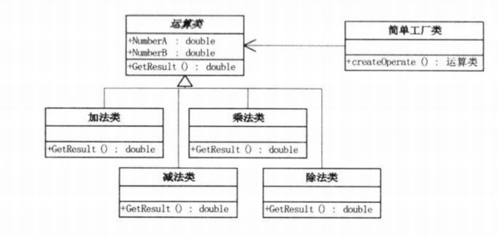
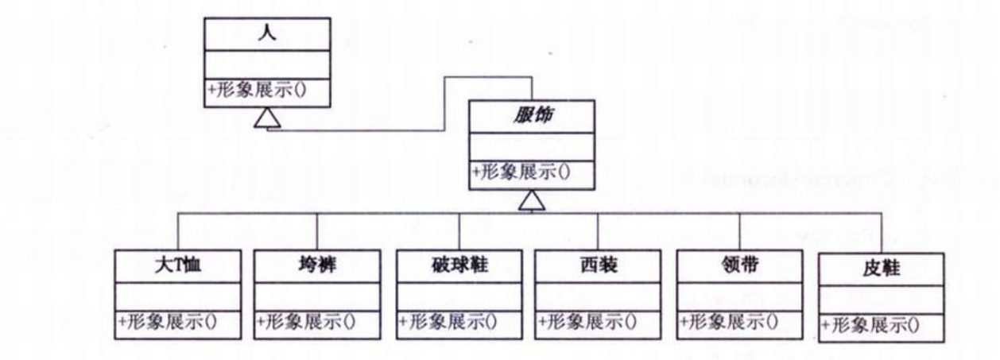
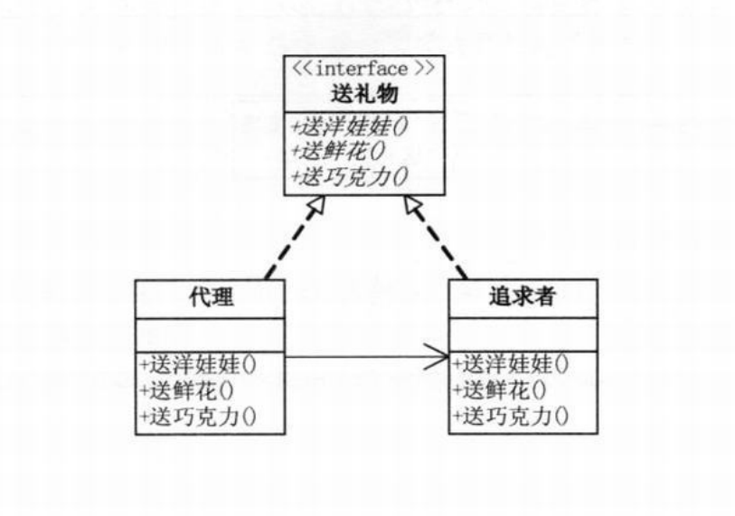
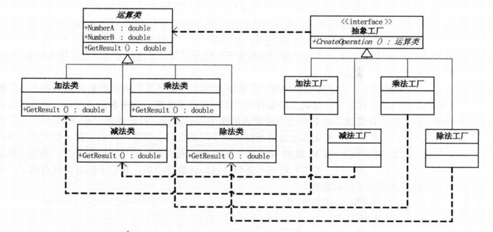
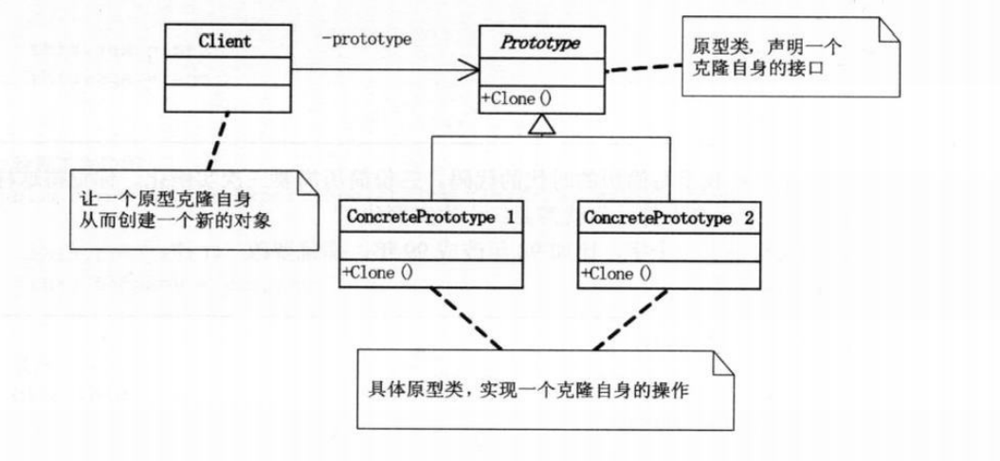
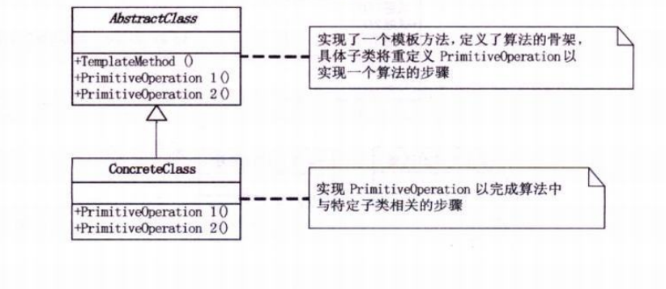

# 设计模式学习笔记

​		**王世泽 - S202175111**


## 一、简单工厂模式

### 1. 案例简介：

​	实现一个计算器功能，用户可以调用加法、减法、乘法等功能，计算器会不断地更新新的功能。

### 2. 实现代码：

​	定义一个抽象类`Operation`，不同的功能继承其并实现其中的`getResult()`方法。

```java
abstract class Operation {
    abstract double getResult(double a, double b);
}

class OperationAdd extends Operation {


    double getResult(double a, double b) {
        return a + b;
    }
}

class OperationSub extends Operation {


    double getResult(double a, double b) {
        return a - b;
    }
}

class OperationMul extends Operation {


    double getResult(double a, double b) {
        return a * b;
    }
}
```

​	使用简单工厂类，在类中进行筛选，协助用户实例化所需要的对象，用户只需调用工厂类，并传入所需功能名称即可。

```java
public class SimpleFacctory {
    public static Operation createOperate(String operate) {
        Operation oper = null;
        switch (operate) {
            case "+":
                oper = new OperationAdd();
                break;
            case "-":
                oper = new OperationSub();
                break;
            case "*":
                oper = new OperationMul();
                break;
        }
        return oper;
    }
}
```

​	客户端调用代码：

```java
public static void main(String[] args) {
    Operation oper = SimpleFacctory.createOperate("+");
    System.out.println(oper.getResult(1, 2));
    oper = SimpleFacctory.createOperate("*");
    System.out.println(oper.getResult(1, 2));
    oper = SimpleFacctory.createOperate("-");
    System.out.println(oper.getResult(1, 2));
}
```

### 3. uml图：



### 4. 总结：

​	简单工厂模式使用简单工厂代替用户进行实例化，在添加新功能时，只需在工厂类中添加新的switch判断即可，用户便可以使用新的功能代号调用功能，不需要改动客户端代码与运算类代码。


## 二、策略模式

> **策略模式（Strategy）：**
>
> ​	定义了算法家族，分别封装起来，让他们之间可以相互替换。此模式让算法的变化，不会影响到使用算法的客户。

### 1. 案例简介：

​	同简单工厂模式

### 2. 实现代码：

​	运算类实现同简单工厂模式，新增`Strategy`类实现策略模式。

```java
public class Strategy {

    public Operation oper;

    public Strategy(String operate) {
        switch (operate) {
            case "+":
                oper = new OperationAdd();
                break;
            case "-":
                oper = new OperationSub();
                break;
            case "*":
                oper = new OperationMul();
                break;
        }
    }

    public double operate(double a, double b) {
        return oper.getResult(a, b);
    }
}
```

​	客户端代码：

```java

public static void main(String[] args) {
    Strategy strategy = new Strategy("+");
    System.out.println(strategy.operate(1, 2));
    strategy = new Strategy("-");
    System.out.println(strategy.operate(1, 2));
    strategy = new Strategy("*");
    System.out.println(strategy.operate(1, 2));

}
```

### 4. 总结：

​	可以看到，策略模式使用了组合的方式，并提供了操作方法供用户使用，使用户和运算类之间实现了完全的屏蔽，客户端只可以调用策略类，对于运算类的调用在策略类中实现，大大减少了系统耦合性。


## 三、 单一职责原则

> **单依职责原则（SRP）:**
>
> ​	就一个类而言，应该仅有一个引起他变化的原因。

### 1. 总结：

​	就一个类而言，应该保证其实现了一种功能；若对于单个类可以拆解成多个类，则可视为其功能过多，承担的职责过多。这样在修改其中一个功能时，势必会改动其他功能代码，导致其他功能不能正常使用。

​	这样的高耦合性的设计，会导致产品脆弱，在变化发生时，设计会遭受到意想不到的破坏。

​	软件设计真正要做的许多内容，就是发现职责，并把那些职责相互分离。


## 四、开放 -- 封闭原则

> **开放 -- 封闭原则:**
>
> ​	软件实体应该可以扩展，但是不可以修改。

### 1. 总结：

​	开放封闭原则其实是指两个方面，即对扩展式开放的，和对更改是封闭的。

​	在实际编程中，无论模块是多么的‘封闭’，都会存在一些无法对之封闭的变化。既然不可能完全封闭，设计人员必须对于他设计的模块应该对那种变化封闭做出选择。他必须先猜测出最有可能发生的变化种类，然后构造抽象来隔离这些变化。

​	在最初编写代码时，假设变化不会发生，当变化发生时，我们就创建抽象来隔离以后发生的同类变化。

​	面对需求，对程序的改动是通过增加新的代码进行的，而不是更改现有的代码。


## 五、装饰模式

> **装饰模式（Decorator）**：
>
> ​	动态的给对象添加一些额外的职责，就添加功能来说，装饰模式比生成子类更为灵活。

### 1. 案例简介：

​	实现人穿不同衣服的功能。

### 2. 代码实现：

​	首先给出被修饰类——`Person`类，类中包含属性`name`，表示人的姓名。并提供了展示功能`show()`，可以展示人身上的衣服。

```java
class Person {
    public Person() {
    }

    private String name;

    public Person(String name) {
        this.name = name;
    }

    public void show() {
        System.out.println("装扮的" + name);
    }
}
```

​	然后构建修饰类，继承`Person`，实现修饰方法，并重写展示方法。

```java
public class Decorator extends Person {
    protected Person component;

    public void Decorate(Person person) {
        this.component = person;
    }

    @Override
    public void show() {
        if (component != null) {
            component.show();
        }
    }

}
```

​	而后是具体的修饰对象，继承修饰类并重写展示方法。

```java
class Tshirt extends Decorator {
    @Override
    public void show() {
        System.out.println("T恤");
        super.show();
    }
}

class Trouser extends Decorator {
    @Override
    public void show() {
        System.out.println("裤子");
        super.show();
    }
}
```

​	最后是客户端代码。

```java

public static void main(String[] args) {
    Person li = new Person("李莉");
    Tshirt tshirt = new Tshirt();
    Trouser trouser = new Trouser();
    //穿t恤
    tshirt.Decorate(li);
    //穿裤子
    trouser.Decorate(tshirt);
    //展示
    trouser.show();
}

//控制台输出
    裤子
    T恤
    装扮的李莉
```

### 3. uml图：



### 4. 总结：

​	装饰模式是为已有功能添加更多功能的一种方式。当系统需要新的功能时，不需要更改已有功能的代码，而是通过装饰类逐层包装的方式，实现所有的功能。

​	装饰类的优点，是吧类中的装饰功能从类中版以去除，这样可以简化原有的类。这样可以有效地把类的核心职责和装饰功能区分开，还能去除相关类中的重复逻辑。


## 六、代理模式：

> **代理模式（Proxy）：**
>
> ​	为其他对象提供一种代理，以控制对这个对象的访问。

### 1. 案例简介：

​	由代理者代替追求者向女生赠送礼物。

### 2. 代码实现：

​	首先要实现送礼物的动作接口，和接受礼物的女生对象。

```java
interface GiveGift {
    void GiveDolls();

    void GiveFlowers();

    void GiveChocolate();
}

class Girl {
    private String name;

    public String getName() {
        return name;
    }

    public void setName(String name) {
        this.name = name;
    }
}
```

​	然后需要提供追求者类，并实现送礼物的动作接口。

```java

class Pursuit implements GiveGift {

    Girl girl;

    public Pursuit(Girl girl) {
        this.girl = girl;
    }

    @Override

    public void GiveDolls() {
        System.out.println(girl.getName() + " 送你洋娃娃");
    }

    @Override
    public void GiveFlowers() {
        System.out.println(girl.getName() + " 送你花");
    }

    @Override
    public void GiveChocolate() {
        System.out.println(girl.getName() + " 送你巧克力");
    }
}
```

​	最后要实现代理类，要在代理类中调用追求者类的方法。

```java
public class Proxy implements GiveGift {
    Pursuit boy;

    public Proxy(Girl girl) {
        this.boy = new Pursuit(girl);
    }

    @Override
    public void GiveDolls() {
        boy.GiveDolls();
    }

    @Override
    public void GiveFlowers() {
        boy.GiveFlowers();
    }

    @Override
    public void GiveChocolate() {
        boy.GiveChocolate();
    }

}
```

​	最后给出客户端实现。

```java

    public static void main(String[] args) {
        Girl girl = new Girl();
        girl.setName("lili");

        Proxy daili = new Proxy(girl);
        //代理赠送
        daili.GiveChocolate();
        daili.GiveDolls();
        daili.GiveFlowers();
    }
```

### 3. uml图：



### 4. 总结：

​	代理模式可以让用户在不接触到目标对象的情况下，调用目标对象的功能。用户对于目标对象功能的调用受到代理的严格约束，不能随意进行调用，这大大加强了系统的安全性，还可以在代理中增加一些前置或者后置处理。


## 七、工厂方法模式：

> **工厂方法模式（Factory Method）：**
>
> ​	定义一个用于创建对象的接口，让子类决定实例化哪一个类。工厂方法是一个类的实例化延迟到其子类。

### 1. 案例简介：

​	同简单工厂模式案例。

### 2. 代码实现：

​	运算类及其实现与简单工厂相同。

​	首先需要提出一个方法工厂接口，给出生产运算类的方法。

```java
interface IFactory {
    Operation CreateOperation();
}
```

​	然后给出工厂接口的实现类，实现具体的运算类方法。

```java
class AddFactory implements IFactory {
    @Override
    public Operation CreateOperation() {
        return new OperationAdd();
    }
}

class SubFactory implements IFactory {
    @Override
    public Operation CreateOperation() {
        return new OperationSub();
    }
}

class MulFactory implements IFactory {
    @Override
    public Operation CreateOperation() {
        return new OperationMul();
    }
}
```

​	客户端通过实例化具体的工厂类，来生成对应的运算类对象。

```java
    public static void main(String[] args) {
        IFactory operFactory = new AddFactory();
        Operation operation = operFactory.CreateOperation();
        System.out.println(operation.getResult(1, 2));
    }
```

### 3. uml图：



### 4. 总结：

​	工厂方法模式实现时，客户端需要决定实例化那一个工厂来实现运算类，选择判断的问题还是存在的，也就是说，工厂方法把简单工厂的内部逻辑判断转移到了客户端代码来进行。如果想要添加功能，本来是改工厂类，而现在修改的是客户端代码。


## 八、原型模式：

> **原型模式（Prototype）：**
>
> ​	用原型实例指定创建对象的种类，并且通过拷贝这些原型创建新的对象。

### 1. uml图：



### 2. 总结：

​	原型模式可以再隐藏源对象具体细节的情况下，获得源对象的复制。

​	原型模式根据编程语言的不同，可以分为浅复制和深复制。

​	浅复制是指复制了源对象的引用，实际上源对象并没有进行复制，只是添加了一个指针，修改其中一个时，另一个也会发生变化。

​	深复制是指完全复制了源对象，这让我们的内存中存在了两份源对象，在分别修改时不会相互影响。


## 九、模板方法模式

> **模板方法模式：**
>
> ​	定义一个操作中的算法的骨架，而将一些步骤延迟到子类中。模板方法使得子类可以不改变一个方法的结构即可重定义该方法的某些特定步骤。

### 1. uml图：



### 2. 总结：

​	模板方法模式是通过把不变行为搬移到超类，去除子类中的重复代码来体现它的优势，提供了一个很好地代码复用平台。

​	当不变和可变的行为在方法的子类实现中混合在一起的时候，不变的行为就会在子类中重复出现。我们通过模板方法模式把这些行为搬移到单一的地方，这样就帮助子类摆脱重复的不变行为的纠结。


## 十、迪米特法则：

> **迪米特法则（LoD）：**
>
> ​	如果两个类不必彼此直接通信，那么这两个类就不应当发生直接的相互作用。如果其中一个类需要调用另一个类的某个方法的话，可以通过第三者转发这个调用。

### 1. 总结：

​	迪米特法则首先强调的前提是在类的结构设计上，每一个类都应当尽量降低成员的访问权限。其中的根本思想，是强调了类之间的松耦合。类之间的耦合越弱，越有利于复用，一个处在弱耦合的类被修改，不会对有关系的类造成波及。


## 十一、依赖倒置原则：

> **依赖倒置原则：**
>
> ​	A. 高层模块不应该依赖底层模块，两个都应该依赖抽象。
>
> ​	B. 抽象不应该依赖细节，细节应该依赖抽象。

### 1. 总结：

​	依赖倒置其实可以说是面向对象设计的标志，用哪种语言来编写程序不重要，如果编写时考虑的都是如何针对抽象编程而不是针对细节编程，即程序中所有的依赖关系都是终止于抽象类或者接口，那就是面向对象的设计，反之那就是过程化的设计了。