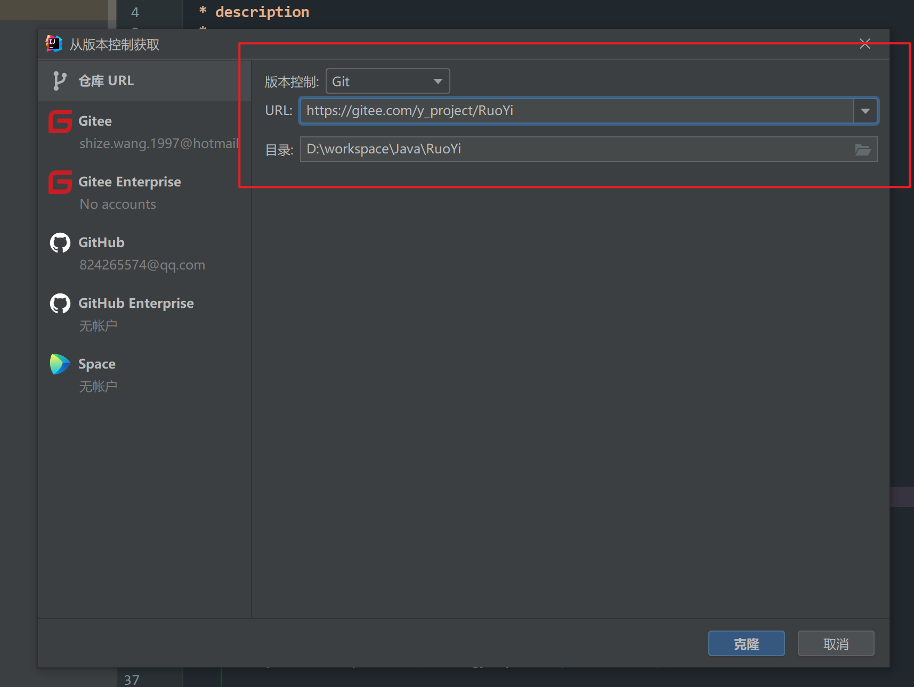
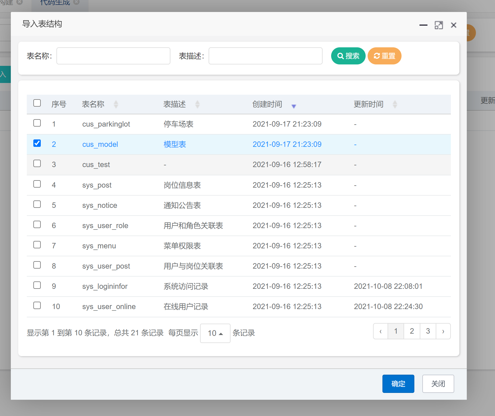
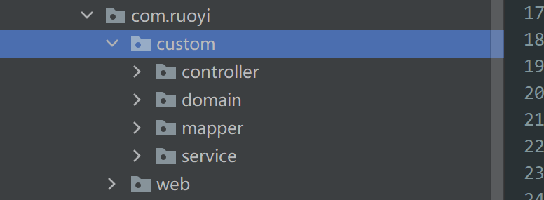

# 若依框架部署文档

​	本文档主要介绍了若依框架的部署过程，并对其开发流程进行了简单的展示。

​	在项目部署阶段，我们分为本地部署和服务器部署两种部署方式进行描述；在项目开发流程展示中，我们分为后端代码和前端配置两个部分进行描述。

## 一、项目部署：

### 1. 环境配置：

​	若依框架所要求的基本环境如下：

```
DK >= 1.8 (推荐1.8版本)
Mysql >= 5.7.0 (推荐5.7版本)
Maven >= 3.0
```

​	本机开发软件环境如下：

```
Navicat 12.0		数据库可视化管理工具
IDEA 2021.2.2		java ide
git 2.33.0			用于项目拉取
FinalShell 3.7.7	用于服务器部署，集成了ftp文件传输的ssh工具
```

### 2. 本机部署：

- **代码拉取：**

  ​	首先将gitee上的代码克隆到本机，代码地址为`https://gitee.com/y_project/RuoYi`。IDEA中集成了git 版本控制功能，直接在IDEA中进行克隆即可。




- **maven配置：**

  ​	成功拉取代码后，IDEA将自动对项目的pom文件进行读取，并调用maven，进行项目所需jar包的下载。注意IDEA会默认使用其自带的maven，若想使用自定义maven版本，则需要在设置中进行设置。

 - **配置修改：**

   ​	代码拉取完成后，我们需要对JDBC配置进行更改，将数据库信息修改为我们本机的数据库信息。

   

- **数据库初始化：**

  ​	在mysql中新建名为`ry`的数据库，注意将其字符集设置为 `utf-8`，否则在导入sql脚本时会报错。

  

  ​	然后在项目文件的`sql`目录下找到两个sql脚本，在mysql中进行运行即可，运行后结果如下。

  

- **项目启动：**

  ​	在完成前期准备工作后，直接运行`ruoyi-admin`下的`RuoYiApplication`即可运行项目。

  

  ​	springboot内置了Tomcat服务器，所以无需单独进行服务器的启动与部署。

  

- **进入系统：**

  ​	项目默认启动端口为80端口，直接在浏览器地址栏中输入`127.0.0.1:80`，即可进入系统。

  

### 3. 服务器部署：

​	若依框架作为基于`springboot`的web项目，只需将项目打成jar包传输至服务器上，即可完成服务器部署。

​	服务器部署中的数据库初始化与本地部署相同，只需在Navicat中添加服务器端mysql地址即可。注意需要在项目配置文件中将jdbc配置修改为服务器的数据库信息。

​	在准备完成后，我们需要对项目进行打包即可。IDEA中集成了maven管理工具，可以方便的进行打包。


​	点击maven中的package即可进行打包，打包完成后在`ruoyi-admin`模块下的`target`文件夹中会出现我们的jar包。


​	只需将其发送到服务器中，即可在服务器上启动项目。启动命令如下：

```shell
java -jar ruoyi-admin.jar
```


## 二、项目开发：

### 1. 建表语句：

​	在我们的业务逻辑中，会用到停车场信息表和停车场模型表两个自定义表，模型表是信息表的字表，描述信息表中每一个停车场的模型位置，建表语句如下：

```sql
/*停车场信息表*/
CREATE TABLE `cus_parkinglot` (
  `parkinglot_id` bigint(20) NOT NULL AUTO_INCREMENT COMMENT '停车场id',
  `user_id` bigint(20) NOT NULL COMMENT '停车场所属管理员id',
  `parkinglot_name` varchar(30) DEFAULT '' COMMENT '停车场名称',
  `parkinglot_loc` varchar(200) DEFAULT '' COMMENT '停车场位置',
  `parkinglot_camera` varchar(200) DEFAULT '' COMMENT '摄像头图片文件位置',
  `parkinglot_capacity` bigint(20) DEFAULT '0' COMMENT '停车场总车位',
  `parkinglot_spare` bigint(20) DEFAULT '0' COMMENT '停车场空闲车位',
  `image` varchar(200) DEFAULT '' COMMENT '渲染图位置',
  `image_update` datetime DEFAULT NULL COMMENT '渲染日期',
  `remark` varchar(500) DEFAULT NULL COMMENT '停车场描述',
  PRIMARY KEY (`parkinglot_id`)
) ENGINE=InnoDB AUTO_INCREMENT=14 DEFAULT CHARSET=utf8mb4 COMMENT='停车场表';

/*停车场模型表*/
CREATE TABLE `cus_model` (
  `model_id` bigint(20) NOT NULL AUTO_INCREMENT COMMENT '模型id',
  `parkinglot_id` bigint(20) NOT NULL COMMENT '停车场id',
  `size_model` varchar(200) DEFAULT '' COMMENT '规模模型位置',
  `reg_model` varchar(200) DEFAULT '' COMMENT '识别模型位置',
  PRIMARY KEY (`model_id`)
) ENGINE=InnoDB AUTO_INCREMENT=8 DEFAULT CHARSET=utf8mb4 COMMENT='模型表';
```

### 2. 代码生成：

​	若依框架提供了强大的代码生成功能，其可以一键生成一张表所需要的前端和后端代码。其提供的生成方式有三种，这里我们将介绍其中的两种。

- **单表生成：**

​	首先是最基本的单表代码生成，本项目中的模型表是一个单独的自定义表，对于该表的增删改查是完全独立的，所以我们可以使用单表代码生成。以管理员身份进入系统，在前端页面找到`系统工具—代码生成`。点击导入，导入我们的模型表。



​	导入完成后，我们可以对我们的生成信息进行配置，点击编辑按钮，进入生成信息配置页面。这里我们可以对与代码的生成格式进行自定义配置，我们需要在生成模板中选择单表生成。


​	同时我们在字段信息中可以针对每一个字段进行配置，使其获得不同的功能。


​	配置完成后，我们点击生成代码，即可下载代码压缩文件。打开压缩文件后，将其中的sql文件导入到我们的数据库中，同时将代码文件解压到我们的项目之中。



​	生成代码包含了前端代码和后端代码。其中后端代码包含了完整的mvc三层结构和实体类，前端代码提供了查询的前端页面。


- **主子表生成：**

  ​	第二种方式为主子表生成，我们以停车场信息表为例进行描述。首先用同样的方法导入停车场信息表，在信息编辑中进行如下配置。

  

  配置完成后进行代码生成，将代码放入相应位置，即可看到主子表的效果。在表单新增和删除中，都会加入其对应的子表信息编辑功能。

  

  

### 3. 菜单配置：

​	在我们完成后端基础代码的生成后，我们需要进行前端的配置，才能获得我们想要的菜单状态。

​	登录管理员用户，进入系统管理目录，选择菜单管理，即可调整功能菜单。


​	我们需要让不同角色看到不同的功能模块，也需要在前端进行配置实现，进入系统管理下的角色管理，在角色设置中可以进行权限的调整。


